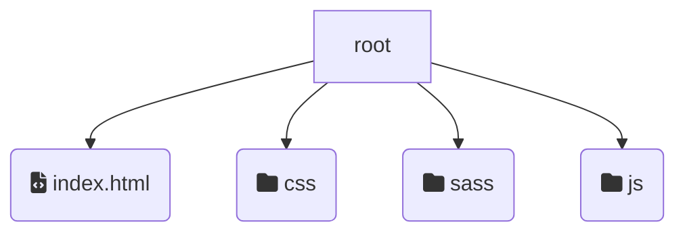
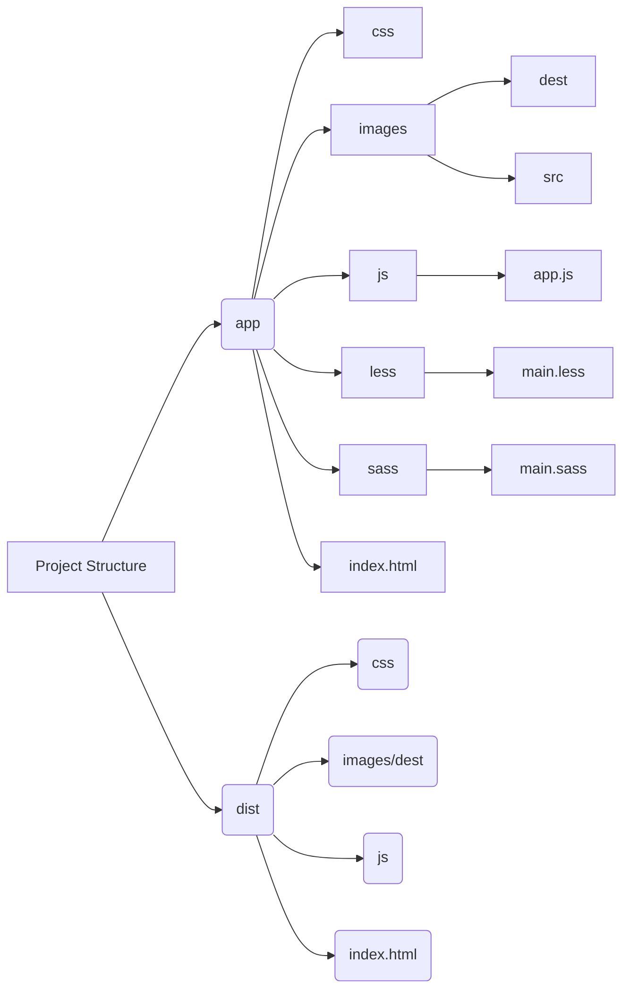

# Gulp 4 Configuration

## Simple Gulp without SASS

- `npm install gulp browser-sync --save-dev`
- `npm init`
- `gulp watch` - to run project

### gulpfile.js

```jsx
const gulp = require("gulp");
const browserSync = require("browser-sync").create();
function watch() {
  browserSync.init({
    server: {
      baseDir: "./",
      index: "/index.html",
    },
  });
  gulp.watch("./*.html").on("change", browserSync.reload);
  gulp.watch("./js/**/*.js").on("change", browserSync.reload);
}
exports.watch = watch;
```

## Simple Gulp with SASS



1. install global gulp-cli and remove gulp: `sudo npm rm --global gulp` and `sudo npm install --global gulp-cli --force`
2. `npm install gulp sass gulp-sass browser-sync --save-dev`
3. `npm init`
4. `gulp watch` - to run project

### gulpfile.js

```jsx
const gulp = require("gulp");
const sass = require("gulp-sass")(require("sass"));
const browserSync = require("browser-sync").create();
//compile sass into css
function style() {
  return gulp
    .src("sass/**/*.sass")
    .pipe(sass().on("error", sass.logError))
    .pipe(gulp.dest("css"))
    .pipe(browserSync.stream());
}
function watch() {
  browserSync.init({
    server: {
      baseDir: "./",
      index: "/index.html",
    },
  });
  gulp.watch("sass/**/*.sass", style);
  gulp.watch("./*.html").on("change", browserSync.reload);
  gulp.watch("./js/**/*.js").on("change", browserSync.reload);
}
exports.style = style;
exports.watch = watch;
```

### package.json

```json
{
  "name": "weather-app",
  "version": "1.0.0",
  "main": "gulpfile.js",
  "devDependencies": {
    "browser-sync": "^2.27.7",
    "gulp": "^4.0.2",
    "gulp-cli": "^2.3.0",
    "gulp-sass": "^5.0.0",
    "sass": "^1.43.4"
  },
  "scripts": {
    "test": "echo \"Error: no test specified\" && exit 1"
  },
  "author": "Dmitry",
  "license": "ISC",
  "dependencies": {
    "accepts": "^1.3.7",
    "after": "^0.8.2",
    "ansi-colors": "^1.1.0",
    "ansi-gray": "^0.1.1",
    "ansi-regex": "^2.1.1",
    "ansi-styles": "^2.2.1",
    "ansi-wrap": "^0.1.0",
    "anymatch": "^3.1.2",
    "append-buffer": "^1.0.2",
    "archy": "^1.0.0",
    "arr-diff": "^4.0.0",
    "arr-filter": "^1.1.2",
    "arr-flatten": "^1.1.0",
    "arr-map": "^2.0.2",
    "arr-union": "^3.1.0",
    "array-each": "^1.0.1",
    "array-initial": "^1.1.0",
    "array-last": "^1.3.0",
    "array-slice": "^1.1.0",
    "array-sort": "^1.0.0",
    "array-unique": "^0.3.2",
    "arraybuffer.slice": "^0.0.7",
    "assign-symbols": "^1.0.0",
    "async": "^1.5.2",
    "async-done": "^1.3.2",
    "async-each": "^1.0.3",
    "async-each-series": "^0.1.1",
    "async-settle": "^1.0.0",
    "atob": "^2.1.2",
    "axios": "^0.21.4",
    "bach": "^1.2.0",
    "backo2": "^1.0.2",
    "balanced-match": "^1.0.2",
    "base": "^0.11.2",
    "base64-arraybuffer": "^0.1.4",
    "base64id": "^2.0.0",
    "batch": "^0.6.1",
    "binary-extensions": "^2.2.0",
    "blob": "^0.0.5",
    "brace-expansion": "^1.1.11",
    "braces": "^3.0.2",
    "browser-sync-client": "^2.27.7",
    "browser-sync-ui": "^2.27.7",
    "bs-recipes": "^1.3.4",
    "bs-snippet-injector": "^2.0.1",
    "buffer-equal": "^1.0.0",
    "buffer-from": "^1.1.2",
    "bytes": "^3.1.0",
    "cache-base": "^1.0.1",
    "call-bind": "^1.0.2",
    "camelcase": "^3.0.0",
    "chalk": "^1.1.3",
    "chokidar": "^3.5.2",
    "class-utils": "^0.3.6",
    "cliui": "^6.0.0",
    "clone": "^2.1.2",
    "clone-buffer": "^1.0.0",
    "clone-stats": "^1.0.0",
    "cloneable-readable": "^1.1.3",
    "code-point-at": "^1.1.0",
    "collection-map": "^1.0.0",
    "collection-visit": "^1.0.0",
    "color-convert": "^2.0.1",
    "color-name": "^1.1.4",
    "color-support": "^1.1.3",
    "commander": "^2.20.3",
    "component-bind": "^1.0.0",
    "component-emitter": "^1.3.0",
    "component-inherit": "^0.0.3",
    "concat-map": "^0.0.1",
    "concat-stream": "^1.6.2",
    "connect": "^3.6.6",
    "connect-history-api-fallback": "^1.6.0",
    "convert-source-map": "^1.8.0",
    "cookie": "^0.4.1",
    "copy-descriptor": "^0.1.1",
    "copy-props": "^2.0.5",
    "core-util-is": "^1.0.3",
    "d": "^1.0.1",
    "debug": "^2.6.9",
    "decamelize": "^1.2.0",
    "decode-uri-component": "^0.2.0",
    "default-compare": "^1.0.0",
    "default-resolution": "^2.0.0",
    "define-properties": "^1.1.3",
    "define-property": "^2.0.2",
    "depd": "^1.1.2",
    "destroy": "^1.0.4",
    "detect-file": "^1.0.0",
    "dev-ip": "^1.0.1",
    "dlv": "^1.1.3",
    "duplexify": "^3.7.1",
    "each-props": "^1.3.2",
    "easy-extender": "^2.3.4",
    "eazy-logger": "^3.1.0",
    "ee-first": "^1.1.1",
    "emoji-regex": "^8.0.0",
    "encodeurl": "^1.0.2",
    "end-of-stream": "^1.4.4",
    "engine.io": "^3.5.0",
    "engine.io-client": "^3.5.2",
    "engine.io-parser": "^2.2.1",
    "error-ex": "^1.3.2",
    "es5-ext": "^0.10.53",
    "es6-iterator": "^2.0.3",
    "es6-symbol": "^3.1.3",
    "es6-weak-map": "^2.0.3",
    "escalade": "^3.1.1",
    "escape-html": "^1.0.3",
    "escape-string-regexp": "^1.0.5",
    "etag": "^1.8.1",
    "eventemitter3": "^4.0.7",
    "expand-brackets": "^2.1.4",
    "expand-tilde": "^2.0.2",
    "ext": "^1.6.0",
    "extend": "^3.0.2",
    "extend-shallow": "^3.0.2",
    "extglob": "^2.0.4",
    "fancy-log": "^1.3.3",
    "fast-levenshtein": "^1.1.4",
    "fill-range": "^7.0.1",
    "finalhandler": "^1.1.0",
    "find-up": "^1.1.2",
    "findup-sync": "^3.0.0",
    "fined": "^1.2.0",
    "flagged-respawn": "^1.0.1",
    "flush-write-stream": "^1.1.1",
    "follow-redirects": "^1.14.5",
    "for-in": "^1.0.2",
    "for-own": "^1.0.0",
    "fragment-cache": "^0.2.1",
    "fresh": "^0.5.2",
    "fs-extra": "^3.0.1",
    "fs-mkdirp-stream": "^1.0.0",
    "fs.realpath": "^1.0.0",
    "function-bind": "^1.1.1",
    "get-caller-file": "^2.0.5",
    "get-intrinsic": "^1.1.1",
    "get-value": "^2.0.6",
    "glob": "^7.2.0",
    "glob-parent": "^5.1.2",
    "glob-stream": "^6.1.0",
    "glob-watcher": "^5.0.5",
    "global-modules": "^1.0.0",
    "global-prefix": "^1.0.2",
    "glogg": "^1.0.2",
    "graceful-fs": "^4.2.8",
    "gulplog": "^1.0.0",
    "has": "^1.0.3",
    "has-ansi": "^2.0.0",
    "has-binary2": "^1.0.3",
    "has-cors": "^1.1.0",
    "has-flag": "^4.0.0",
    "has-symbols": "^1.0.2",
    "has-value": "^1.0.0",
    "has-values": "^1.0.0",
    "homedir-polyfill": "^1.0.3",
    "hosted-git-info": "^2.8.9",
    "http-errors": "^1.7.3",
    "http-proxy": "^1.18.1",
    "iconv-lite": "^0.4.24",
    "immutable": "^3.8.2",
    "indexof": "^0.0.1",
    "inflight": "^1.0.6",
    "inherits": "^2.0.4",
    "ini": "^1.3.8",
    "interpret": "^1.4.0",
    "invert-kv": "^1.0.0",
    "is-absolute": "^1.0.0",
    "is-accessor-descriptor": "^1.0.0",
    "is-arrayish": "^0.2.1",
    "is-binary-path": "^2.1.0",
    "is-buffer": "^1.1.6",
    "is-core-module": "^2.8.0",
    "is-data-descriptor": "^1.0.0",
    "is-descriptor": "^1.0.2",
    "is-extendable": "^1.0.1",
    "is-extglob": "^2.1.1",
    "is-fullwidth-code-point": "^1.0.0",
    "is-glob": "^4.0.3",
    "is-negated-glob": "^1.0.0",
    "is-number": "^7.0.0",
    "is-number-like": "^1.0.8",
    "is-plain-object": "^2.0.4",
    "is-relative": "^1.0.0",
    "is-unc-path": "^1.0.0",
    "is-utf8": "^0.2.1",
    "is-valid-glob": "^1.0.0",
    "is-windows": "^1.0.2",
    "is-wsl": "^1.1.0",
    "isarray": "^1.0.0",
    "isexe": "^2.0.0",
    "isobject": "^3.0.1",
    "json-stable-stringify-without-jsonify": "^1.0.1",
    "jsonfile": "^3.0.1",
    "just-debounce": "^1.1.0",
    "kind-of": "^5.1.0",
    "last-run": "^1.1.1",
    "lazystream": "^1.0.1",
    "lcid": "^1.0.0",
    "lead": "^1.0.0",
    "liftoff": "^3.1.0",
    "limiter": "^1.1.5",
    "load-json-file": "^1.1.0",
    "localtunnel": "^2.0.2",
    "lodash": "^4.17.21",
    "lodash.isfinite": "^3.3.2",
    "make-iterator": "^1.0.1",
    "map-cache": "^0.2.2",
    "map-visit": "^1.0.0",
    "matchdep": "^2.0.0",
    "micromatch": "^4.0.4",
    "mime": "^1.4.1",
    "mime-db": "^1.50.0",
    "mime-types": "^2.1.33",
    "minimatch": "^3.0.4",
    "mitt": "^1.2.0",
    "mixin-deep": "^1.3.2",
    "ms": "^2.0.0",
    "mute-stdout": "^1.0.1",
    "nanomatch": "^1.2.13",
    "negotiator": "^0.6.2",
    "next-tick": "^1.0.0",
    "normalize-package-data": "^2.5.0",
    "normalize-path": "^3.0.0",
    "now-and-later": "^2.0.1",
    "number-is-nan": "^1.0.1",
    "object-copy": "^0.1.0",
    "object-keys": "^1.1.1",
    "object-visit": "^1.0.1",
    "object.assign": "^4.1.2",
    "object.defaults": "^1.1.0",
    "object.map": "^1.0.1",
    "object.pick": "^1.3.0",
    "object.reduce": "^1.0.1",
    "on-finished": "^2.3.0",
    "once": "^1.4.0",
    "openurl": "^1.1.1",
    "opn": "^5.3.0",
    "ordered-read-streams": "^1.0.1",
    "os-locale": "^1.4.0",
    "p-limit": "^2.3.0",
    "p-try": "^2.2.0",
    "parse-filepath": "^1.0.2",
    "parse-json": "^2.2.0",
    "parse-node-version": "^1.0.1",
    "parse-passwd": "^1.0.0",
    "parseqs": "^0.0.6",
    "parseuri": "^0.0.6",
    "parseurl": "^1.3.3",
    "pascalcase": "^0.1.1",
    "path-dirname": "^1.0.2",
    "path-exists": "^2.1.0",
    "path-is-absolute": "^1.0.1",
    "path-parse": "^1.0.7",
    "path-root": "^0.1.1",
    "path-root-regex": "^0.1.2",
    "path-type": "^1.1.0",
    "picomatch": "^2.3.0",
    "pify": "^2.3.0",
    "pinkie": "^2.0.4",
    "pinkie-promise": "^2.0.1",
    "plugin-error": "^1.0.1",
    "portscanner": "^2.1.1",
    "posix-character-classes": "^0.1.1",
    "pretty-hrtime": "^1.0.3",
    "process-nextick-args": "^2.0.1",
    "pump": "^2.0.1",
    "pumpify": "^1.5.1",
    "qs": "^6.2.3",
    "range-parser": "^1.2.1",
    "raw-body": "^2.4.1",
    "read-pkg": "^1.1.0",
    "read-pkg-up": "^1.0.1",
    "readable-stream": "^2.3.7",
    "readdirp": "^3.6.0",
    "rechoir": "^0.6.2",
    "regex-not": "^1.0.2",
    "remove-bom-buffer": "^3.0.0",
    "remove-bom-stream": "^1.2.0",
    "remove-trailing-separator": "^1.1.0",
    "repeat-element": "^1.1.4",
    "repeat-string": "^1.6.1",
    "replace-ext": "^2.0.0",
    "replace-homedir": "^1.0.0",
    "require-directory": "^2.1.1",
    "require-main-filename": "^2.0.0",
    "requires-port": "^1.0.0",
    "resolve": "^1.20.0",
    "resolve-dir": "^1.0.1",
    "resolve-options": "^1.1.0",
    "resolve-url": "^0.2.1",
    "resp-modifier": "^6.0.2",
    "ret": "^0.1.15",
    "rx": "^4.1.0",
    "rxjs": "^5.5.12",
    "safe-buffer": "^5.1.2",
    "safe-regex": "^1.1.0",
    "safer-buffer": "^2.1.2",
    "semver": "^5.7.1",
    "semver-greatest-satisfied-range": "^1.1.0",
    "send": "^0.16.2",
    "serve-index": "^1.9.1",
    "serve-static": "^1.13.2",
    "server-destroy": "^1.0.1",
    "set-blocking": "^2.0.0",
    "set-value": "^2.0.1",
    "setprototypeof": "^1.1.1",
    "snapdragon": "^0.8.2",
    "snapdragon-node": "^2.1.1",
    "snapdragon-util": "^3.0.1",
    "socket.io": "^2.4.0",
    "socket.io-adapter": "^1.1.2",
    "socket.io-client": "^2.4.0",
    "socket.io-parser": "^3.4.1",
    "source-map": "^0.5.7",
    "source-map-resolve": "^0.5.3",
    "source-map-url": "^0.4.1",
    "sparkles": "^1.0.1",
    "spdx-correct": "^3.1.1",
    "spdx-exceptions": "^2.3.0",
    "spdx-expression-parse": "^3.0.1",
    "spdx-license-ids": "^3.0.10",
    "split-string": "^3.1.0",
    "stack-trace": "^0.0.10",
    "static-extend": "^0.1.2",
    "statuses": "^1.3.1",
    "stream-exhaust": "^1.0.2",
    "stream-shift": "^1.0.1",
    "stream-throttle": "^0.1.3",
    "string_decoder": "^1.1.1",
    "string-width": "^1.0.2",
    "strip-ansi": "^3.0.1",
    "strip-bom": "^2.0.0",
    "supports-color": "^2.0.0",
    "sver-compat": "^1.5.0",
    "symbol-observable": "^1.0.1",
    "tfunk": "^4.0.0",
    "through2": "^2.0.5",
    "through2-filter": "^3.0.0",
    "time-stamp": "^1.1.0",
    "to-absolute-glob": "^2.0.2",
    "to-array": "^0.1.4",
    "to-object-path": "^0.3.0",
    "to-regex": "^3.0.2",
    "to-regex-range": "^5.0.1",
    "to-through": "^2.0.0",
    "toidentifier": "^1.0.0",
    "transfob": "^1.0.0",
    "type": "^1.2.0",
    "typedarray": "^0.0.6",
    "ua-parser-js": "^1.0.2",
    "unc-path-regex": "^0.1.2",
    "undertaker": "^1.3.0",
    "undertaker-registry": "^1.0.1",
    "union-value": "^1.0.1",
    "unique-stream": "^2.3.1",
    "universalify": "^0.1.2",
    "unpipe": "^1.0.0",
    "unset-value": "^1.0.0",
    "upath": "^1.2.0",
    "urix": "^0.1.0",
    "use": "^3.1.1",
    "util-deprecate": "^1.0.2",
    "utils-merge": "^1.0.1",
    "v8flags": "^3.2.0",
    "validate-npm-package-license": "^3.0.4",
    "value-or-function": "^3.0.0",
    "vinyl": "^2.2.1",
    "vinyl-fs": "^3.0.3",
    "vinyl-sourcemap": "^1.1.0",
    "vinyl-sourcemaps-apply": "^0.2.1",
    "which": "^1.3.1",
    "which-module": "^2.0.0",
    "wrap-ansi": "^6.2.0",
    "wrappy": "^1.0.2",
    "ws": "^7.4.6",
    "xmlhttprequest-ssl": "^1.6.3",
    "xtend": "^4.0.2",
    "y18n": "^4.0.3",
    "yargs": "^15.4.1",
    "yargs-parser": "^18.1.3",
    "yeast": "^0.1.2"
  },
  "description": ""
}
```

## Gulp. Настройка, установка, плагины

Author: Фрилансер по жизни - IT и фриланс

[https://youtu.be/stFOy0Noahg](https://youtu.be/stFOy0Noahg)

1.  Install Gulp globally - [https://gulpjs.com/docs/en/getting-started/quick-start](https://gulpjs.com/docs/en/getting-started/quick-start)
2.  In project folder `npm init` - input some info about project, answer the questions
    use index.html for entry point
3.  Install gulp in project folder
    `npm install gulp --save-devsudo npm i -g gulp-cli` - если ошибка при запуске таска
4.  Для создания сценариев на нужно создать файл gulpfile.js
5.  Before config gulpfile, мы создадим иерархию файлов нашего проекта:
    - `#src` - такое название для папки только для того чтобы она всегда была расположена вначале проекта, в корне создаем index.html
      - img
      - js
      - sass
      - fonts
6.  next - general setting gulp file
7.  next - install plugins. Example: `npm install browser-sync --save-dev`
8.  in gulpfile create variable for browser-sync and function that sync our page
9.  для сборки файлов по частям, например header, footer, используем плагин _file-include_`npm i gulp-file-include --save-dev`
    как и ранее доп создаем переменную и добавляем выполнение в функцию html `.pipe.(fileinclude())`
    inside index.html now we can use `@@include('_header.html')`

        create header.html and inside input some code, example:
        `<header class="header"> 	 <h1>my header</h1> 	</header>`

10. для автоудаления папок, которые мы пересоздаем ставим еще одни пакет
    `npm i del --save-dev`
11. `npm i gulp-sass --save-dev`
12. `npm i gulp-autoprefixer --save-dev`
13. `npm install --save-dev gulp-group-css-media-queries`
14. `npm install gulp-clean-css --save-dev`
15. `npm i gulp-rename --save-dev`
16. `npm i terser --save-dev` - parser and mangler/compressor toolkit for ES6+
17. `npm i gulp-uglify-es --save-dev` - вместо выше тк нужно тот настроить еще
18. `npm i gulp-babel --save-dev` - if I want to use latest js features in old browsers
19. `npm i gulp-imagemin --save-dev` - image optimization
20. `npm i gulp-webp --save-dev`
21. `npm i gulp-webp-html --save-dev`
22. `npm i gulp-webpcss --save-dev`

чтобы проверить поддерживает ли браузер webp, добавляем спец код (необходим для вставки css плагина webcss тк он привязывается к класу .webp)

```js
function testWebP(callback) {
  var webP = new Image();
  webP.onload = webP.onerror = function () {
    callback(webP.height == 2);
  };
  webP.src =
    "data:image/webp;base64,UklGRjoAAABXRUJQVlA4IC4AAACyAgCdASoCAAIALmk0mk0iIiIiIgBoSygABc6WWgAA/veff/0PP8bA//LwYAAA";
}

testWebP(function (support) {
  if (support == true) {
    document.querySelector("body").classList.add("webp");
  } else {
    document.querySelector("body").classList.add("no-webp");
  }
});
```

1. `npm install --save-dev gulp-svg-sprite` - is a Gulp plugin wrapping around svg-sprite which takes a bunch of SVG files, optimizes them and bakes them into SVG sprites of several types
   to run this task (its doesnt auto run), we shoud with running gulp `svgSprite`
2. `npm install --save-dev gulp-ttf2woff gulp-ttf2woff2`
3. `npm install --save-dev gulp-fonter` - this plugin is basically gulp wrapper for fonteditor-core with ability to save in multiple formats at once.
   to run `gulp otf2ttf` wher otf2ttf its our function

**Для нового проекта естественно не нужно все заново создавать, мы делаем следующее**

1. копируем уже готовые файлы* gulpfile.js, package.json* и папку _src_
2. далее в папке проектом делаем `npm i` - далее происходит автоустановка всех плагинов
3. далее работаем как обычно

### gulpfile.js

```jsx
// let project_folder = "dist";
let project_folder = require("path").basename(__dirname); // if I want to rename dist folder to project name
let source_folder = "#src";

let fs = require("fs");

let path = {
  build: {
    html: project_folder + "/",
    css: project_folder + "/css/",
    js: project_folder + "/js/",
    img: project_folder + "/img/",
    fonts: project_folder + "/fonts/",
  },
  src: {
    html: [source_folder + "/*.html", "!" + source_folder + "/_*.html"],
    css: source_folder + "/sass/style.sass",
    js: source_folder + "/js/script.js",
    img: source_folder + "/img/**/*.{jpg,png,svg,gif,ico,webp}",
    fonts: source_folder + "/fonts/*.ttf",
  },
  watch: {
    html: source_folder + "/**/*.html",
    css: source_folder + "/sass/**/*.sass",
    js: source_folder + "/js/**/*.js",
    img: source_folder + "/img/**/*.{jpg,png,svg,gif,ico,webp}",
  },
  clean: "./" + project_folder + "/",
};

let { src, dest } = require("gulp"),
  gulp = require("gulp"),
  browsersync = require("browser-sync").create(),
  fileinclude = require("gulp-file-include"),
  del = require("del"),
  sass = require("gulp-sass"),
  autoprefixer = require("gulp-autoprefixer"),
  group_media = require("gulp-group-css-media-queries"),
  clean_css = require("gulp-clean-css"),
  rename = require("gulp-rename"),
  uglify = require("gulp-uglify-es").default,
  // terser = require("terser").default; //A JavaScript parser and mangler/compressor toolkit for ES6
  imagemin = require("gulp-imagemin"),
  webp = require("gulp-webp"),
  webphtml = require("gulp-webp-html"),
  webpcss = require("gulp-webpcss"),
  svgSprite = require("gulp-svg-sprite"),
  ttf2woff = require("gulp-ttf2woff"),
  ttf2woff2 = require("gulp-ttf2woff2"),
  fonter = require("gulp-fonter");

function browserSync(params) {
  browsersync.init({
    server: {
      baseDir: "./" + project_folder + "/",
    },
    port: 3000,
    notify: false,
  });
}

function html() {
  return src(path.src.html)
    .pipe(fileinclude())
    .pipe(webphtml())
    .pipe(dest(path.build.html))
    .pipe(browsersync.stream());
}

function css() {
  return src(path.src.css)
    .pipe(
      sass({
        outputStyle: "expanded",
      })
    )
    .pipe(group_media())
    .pipe(
      autoprefixer({
        overrideBrowserslist: ["last 5 version"],
        cascade: true,
      })
    )
    .pipe(webpcss())
    .pipe(dest(path.build.css))
    .pipe(clean_css())
    .pipe(rename({ extname: ".min.css" }))
    .pipe(dest(path.build.css))
    .pipe(browsersync.stream());
}

function js() {
  return (
    src(path.src.js)
      .pipe(fileinclude())
      .pipe(dest(path.build.js))
      // .pipe(terser)
      .pipe(uglify())
      .pipe(rename({ extname: ".min.js" }))
      .pipe(dest(path.build.js))
      .pipe(browsersync.stream())
  );
}

function images() {
  return src(path.src.img)
    .pipe(
      webp({
        quality: 70,
      })
    )
    .pipe(dest(path.build.img))
    .pipe(src(path.src.img))
    .pipe(
      imagemin({
        progressive: true,
        svgoPlugins: [{ removeViewBox: false }],
        interlaced: true,
        optimizationLevel: 3, //0 to 7
      })
    )
    .pipe(dest(path.build.img))
    .pipe(browsersync.stream());
}

function fonts() {
  src(path.src.fonts).pipe(ttf2woff()).pipe(dest(path.build.fonts));
  return src(path.src.fonts).pipe(ttf2woff2()).pipe(dest(path.build.fonts));
}

gulp.task("otf2ttf", function () {
  return src([source_folder + "/fonts/*.otf"])
    .pipe(
      fonter({
        formats: ["ttf"],
      })
    )
    .pipe(dest(source_folder + "/fonts/"));
});

gulp.task("svgSprite", function () {
  return gulp
    .src([source_folder + "/iconsprite/*.svg"])
    .pipe(
      svgSprite({
        mode: {
          stack: {
            sprite: "..icons/icons.svg", //sprite file name
            // exaple: true  //если мы хотим чтобы создавалсф файл с примерами иконок
          },
        },
      })
    )
    .pipe(dest(path.build.img));
});

// function fontsStyle(params) {
//   let file_content = fs.readFileSync(source_folder + "/sass/fonts.sass");
//   if (file_content == "") {
//     fs.writeFile(source_folder + "/scss/fonts.scss", "", cb);
//     return fs.readdir(path.build.fonts, function (err, items) {
//       if (items) {
//         let c_fontname;
//         for (var i = 0; i < items.length; i++) {
//           let fontname = items[i].split(".");
//           fontname = fontname[0];
//           if (c_fontname != fontname) {
//             fs.appendFile(
//               source_folder + "/scss/fonts.sass",
//               '@include font("' +
//                 fontname +
//                 '", "' +
//                 fontname +
//                 '", "400", "normal");\\r\\n',
//               cb
//             );
//           }
//           c_fontname = fontname;
//         }
//       }
//     });
//   }
// }

// function cb() {}

function watchFiles() {
  gulp.watch([path.watch.html], html);
  gulp.watch([path.watch.css], css);
  gulp.watch([path.watch.js], js);
  gulp.watch([path.watch.img], images);
}

function clean() {
  return del(path.clean);
}

let build = gulp.series(
  clean,
  gulp.parallel(js, css, html, images, fonts)
  // ,fontsStyle
);
let watch = gulp.parallel(build, watchFiles, browserSync);

// exports.fontsStyle = fontsStyle;
exports.fonts = fonts;
exports.images = images;
exports.js = js;
exports.css = css;
exports.html = html;
exports.build = build;
exports.watch = watch;
exports.default = watch;
```

### package.json

```jsx

  "name": "gulp-config",
  "version": "1.0.0",
  "description": "simple config for gulp",
  "main": "index.html",
  "scripts": {
    "test": "echo \\"Error: no test specified\\" && exit 1"
  },
  "author": "dmitry",
  "license": "ISC",
  "devDependencies": {
    "browser-sync": "^2.26.7",
    "del": "^5.1.0",
    "gulp": "^4.0.2",
    "gulp-autoprefixer": "^7.0.1",
    "gulp-clean-css": "^4.3.0",
    "gulp-file-include": "^2.2.2",
    "gulp-fonter": "^0.3.0",
    "gulp-group-css-media-queries": "^1.2.2",
    "gulp-imagemin": "^7.1.0",
    "gulp-rename": "^2.0.0",
    "gulp-sass": "^4.1.0",
    "gulp-svg-sprite": "^1.5.0",
    "gulp-ttf2woff": "^1.1.1",
    "gulp-ttf2woff2": "^3.0.0",
    "gulp-webp": "^4.0.1",
    "gulp-webp-css": "^1.1.0",
    "gulp-webp-html": "^1.0.2",
    "gulp-webpcss": "^1.1.1"
  },
  "dependencies": {
    "gulp-uglify-es": "^2.0.0",
    "terser": "^4.7.0"
  }
}
```

## Gulp 4: Актуальное и исчерпывающее руководство для самых маленьких

Author: WebDesign Master
[Gulp 4 - Актуальное и исчерпывающее руководство для самых маленьких](https://www.youtube.com/watch?v=n-N1BnloIVE)
Article: [https://webdesign-master.ru/blog/tools/gulp-4-lesson.html](https://webdesign-master.ru/blog/tools/gulp-4-lesson.html)

**Материалы**:

1. [Документация Gulp на русском](https://webdesign-master.ru/blog/docs/gulp-documentation.html)
2. [Проект-пример данного урока на GitHub](https://github.com/agragregra/gulp-4-lesson)

Если в дальнейшем нам необходимо будет заново установить все используемые в проекте пакеты, можно будет сделать это всего одной командой `npm i`

Для начала установим Gulp локально в наш проект командой:
`npm i gulp --save-dev`

Gulp: /usr/local/bin/gulp: No such file or directory
`npm install --save-dev gulp gulp-cli` should do the trick. You can then run it using:
`./node_modules/.bin/gulpnpm run gulp` if you add gulp to the scripts section of package.json.

Для сбора проекта в отдельную папку используем
`gulp build`

### Project Structure



### index.html

```html
<!DOCTYPE html>
<html lang="en">
  <head>
    <meta charset="UTF-8" />
    <title>Document</title>

    <!-- Подключаем стили проекта -->
    <link rel="stylesheet" href="css/app.min.css" />
  </head>

  <body>
    <p>Далеко-далеко за словесными горами в стране, гласных и согласных...</p>

    <!-- Подключаем оптимизированное изображение -->
    

    <!-- Подключаем скрипты проекта -->
    <script src="js/app.min.js"></script>
  </body>
</html>
```

### gulpfile.js

```jsx
// Определяем переменную "preprocessor"
let preprocessor = "sass";

// Определяем константы Gulp
const { src, dest, parallel, series, watch } = require("gulp");

// Подключаем Browsersync
const browserSync = require("browser-sync").create();

// Подключаем gulp-concat
const concat = require("gulp-concat");

// Подключаем gulp-uglify-es
const uglify = require("gulp-uglify-es").default;

// Подключаем модули gulp-sass и gulp-less
const sass = require("gulp-sass")(require("sass"));
const less = require("gulp-less");

// Подключаем Autoprefixer
const autoprefixer = require("gulp-autoprefixer");

// Подключаем модуль gulp-clean-css
const cleancss = require("gulp-clean-css");

// Подключаем compress-images для работы с изображениями
const imagecomp = require("compress-images");

// Подключаем модуль del
const del = require("del");

// Определяем логику работы Browsersync
function browsersync() {
  browserSync.init({
    // Инициализация Browsersync
    server: { baseDir: "app/" }, // Указываем папку сервера
    notify: false, // Отключаем уведомления
    online: true, // Режим работы: true или false
  });
}

function scripts() {
  return src([
    // Берем файлы из источников
    "node_modules/jquery/dist/jquery.min.js", // Пример подключения библиотеки
    "app/js/app.js", // Пользовательские скрипты, использующие библиотеку, должны быть подключены в конце
  ])
    .pipe(concat("app.min.js")) // Конкатенируем в один файл
    .pipe(uglify()) // Сжимаем JavaScript
    .pipe(dest("app/js/")) // Выгружаем готовый файл в папку назначения
    .pipe(browserSync.stream()); // Триггерим Browsersync для обновления страницы
}

function styles() {
  return src("app/" + preprocessor + "/main." + preprocessor + "") // Выбираем источник: "app/sass/main.sass" или "app/less/main.less"
    .pipe(eval(preprocessor)()) // Преобразуем значение переменной "preprocessor" в функцию
    .pipe(concat("app.min.css")) // Конкатенируем в файл app.min.js
    .pipe(
      autoprefixer({ overrideBrowserslist: ["last 10 versions"], grid: true })
    ) // Создадим префиксы с помощью Autoprefixer
    .pipe(
      cleancss({
        level: { 1: { specialComments: 0 } } /* , format: 'beautify' */,
      })
    ) // Минифицируем стили
    .pipe(dest("app/css/")) // Выгрузим результат в папку "app/css/"
    .pipe(browserSync.stream()); // Сделаем инъекцию в браузер
}

async function images() {
  imagecomp(
    "app/images/src/**/*", // Берём все изображения из папки источника
    "app/images/dest/", // Выгружаем оптимизированные изображения в папку назначения
    { compress_force: false, statistic: true, autoupdate: true },
    false, // Настраиваем основные параметры
    { jpg: { engine: "mozjpeg", command: ["-quality", "75"] } }, // Сжимаем и оптимизируем изображеня
    { png: { engine: "pngquant", command: ["--quality=75-100", "-o"] } },
    { svg: { engine: "svgo", command: "--multipass" } },
    {
      gif: {
        engine: "gifsicle",
        command: ["--colors", "64", "--use-col=web"],
      },
    },
    function (err, completed) {
      // Обновляем страницу по завершению
      if (completed === true) {
        browserSync.reload();
      }
    }
  );
}

function cleanimg() {
  return del("app/images/dest/**/*", { force: true }); // Удаляем все содержимое папки "app/images/dest/"
}

function buildcopy() {
  return src(
    [
      // Выбираем нужные файлы
      "app/css/**/*.min.css",
      "app/js/**/*.min.js",
      "app/images/dest/**/*",
      "app/**/*.html",
    ],
    { base: "app" }
  ) // Параметр "base" сохраняет структуру проекта при копировании
    .pipe(dest("dist")); // Выгружаем в папку с финальной сборкой
}

function cleandist() {
  return del("dist/**/*", { force: true }); // Удаляем все содержимое папки "dist/"
}

function startwatch() {
  // Выбираем все файлы JS в проекте, а затем исключим с суффиксом .min.js
  watch(["app/**/*.js", "!app/**/*.min.js"], scripts);

  // Мониторим файлы препроцессора на изменения
  watch("app/**/" + preprocessor + "/**/*", styles);

  // Мониторим файлы HTML на изменения
  watch("app/**/*.html").on("change", browserSync.reload);

  // Мониторим папку-источник изображений и выполняем images(), если есть изменения
  watch("app/images/src/**/*", images);
}

// Экспортируем функцию browsersync() как таск browsersync. Значение после знака = это имеющаяся функция.
exports.browsersync = browsersync;

// Экспортируем функцию scripts() в таск scripts
exports.scripts = scripts;

// Экспортируем функцию styles() в таск styles
exports.styles = styles;

// Экспорт функции images() в таск images
exports.images = images;

// Экспортируем функцию cleanimg() как таск cleanimg
exports.cleanimg = cleanimg;

// Создаем новый таск "build", который последовательно выполняет нужные операции
exports.build = series(cleandist, styles, scripts, images, buildcopy);

// Экспортируем дефолтный таск с нужным набором функций
exports.default = parallel(styles, scripts, browsersync, startwatch);
```

### package.json

```json
{
  "name": "myproject",
  "version": "1.0.0",
  "description": "",
  "main": "index.js",
  "scripts": {
    "test": "echo \"Error: no test specified\" && exit 1"
  },
  "author": "",
  "license": "ISC",
  "devDependencies": {
    "browser-sync": "^2.26.12",
    "del": "^5.1.0",
    "gulp": "^4.0.2",
    "gulp-autoprefixer": "^7.0.1",
    "gulp-clean-css": "^4.3.0",
    "gulp-concat": "^2.6.1",
    "gulp-imagemin": "^7.1.0",
    "gulp-less": "^4.0.1",
    "gulp-newer": "^1.4.0",
    "gulp-sass": "^4.1.0",
    "gulp-uglify-es": "^2.0.0",
    "jquery": "^3.5.1"
  }
}
```
